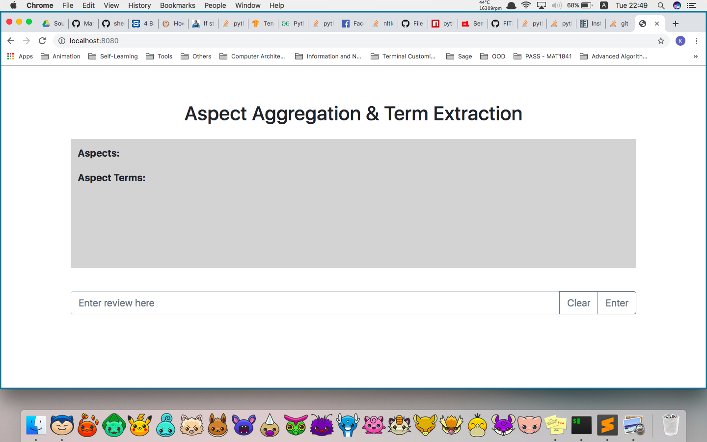

# Project Introduction
The focus of this project is on the aspect aggregation and aspect term extraction. It is mainly made for our FYP work.

### What is aspect term extraction (ATE)?
Given a set of sentences with pre-identified entities (e.g., restaurants), identify the aspect terms present in the sentences.

An aspect term names a particular aspect of the target entity. For example:

"I liked the service and the staff, but not the food”. →  {service, staff, food}

“The food was nothing much, but I loved the staff” → {food, staff}

### What is aspect category detection/aspect aggregation?
Given a predefined set of aspect categories (e.g., price, food), identify the aspect categories discussed in a given sentence. Aspect categories are typically coarser than the aspect term extraction, and they do not necessarily occur as terms in the given sentence. For example, given the set of aspect categories {food, service, price, ambiance, anecdotes/miscellaneous}:

“The restaurant was too expensive”  → {price}

“The restaurant was expensive, but the menu was great” → {price, food}

***

# Libraries needed for FYP2
 Do not worry about the installation of these libraries as there would be a script to complete for you!

### Aspect term extraction
  - os
  - numpy
  - sklearn
  - tensorflow
  - time
  - sys
  - logging

### Aspect aggregation
  - os
  - numpy
  - sklearn
  - tensorflow
  - tensorflow_hub
  - itertools
  - pickle
  - string
  - pathlib
  - xml
  - nltk
  - keras
  - gensim
  - re

### Word Embedding
  - AmazonWE (http://sentic.net/AmazonWE.zip)
  - GoogleNews (https://drive.google.com/file/d/0B7XkCwpI5KDYNlNUTTlSS21pQmM/edit?usp=sharing)
  - Glove (http://nlp.stanford.edu/data/glove.6B.zip, http://nlp.stanford.edu/data/glove.840B.300d.zip)
  - Fasttext Wiki (https://dl.fbaipublicfiles.com/fasttext/vectors-english/crawl-300d-2M.vec.zip)

### UI
  - json
  - lxml
  - npm (https://nodejs.org/en/download/)*
    - socket.io
    - fs
    - http
    - path
    - express
    - python-shell
(*: non-python related)

*** 

# Step 1: Preliminary Check
Make sure your python is using the Anaconda path. You could check this by issue the command below to your terminal

```
which python
```

Example output:


UI preferred browser:
- Google Chrome

Preferred OS:
- Unix-based (As the probability that you might encounter errors/bugs is relatively lower than other OS in this project.)

###  IMPORTANT! INSTALL THIS BEFORE PROCEEDING TO THE NEXT SECTION!
How to install npm on Windows:
- https://www.guru99.com/download-install-node-js.html

How to install npm on MacOS:
- https://blog.teamtreehouse.com/install-node-js-npm-mac

***

# Step 2: Setup
After the preliminary check is finished, we can start installing all the modules/libraries required. 
Here, we wrote a bash script to facilitate you for the setup of all necessary libraries required. To run it, please issue this to your terminal:

```
./setup_all.sh
```

It will take some time as some of the files needed have considerably big capacity - up to 5 GB. We would suggest you to skip the download section for word embedding as the pretrained models have already included in our project.

If you encounter any file permission problem from stopping you executing the bash script, please issue this to your terminal:

```
chmod +x setup_all.sh
```

***

# Step 3: User Interface (UI)
The UI and its functionalities are created and connected using NodeJS framework and Python (Flask, Keras and Tensorflow). 
In order to let the users have a better experience with our project, we created 2 API links (one for pre-trained Keras model, another one for pre-trained Tensorflow model) hosted by 2 local servers to reduce the model loading time.
Therefore, there would be 3 terminals required for running the UI as the last one would act as both the main server and the web server.

### Step 3.1: type command below in Terminal 1:
```
python asp_agg_api.py (in directory "FIT3162---Zhiwei-and-Friends")
```

### Step 3.2: type command below in Terminal 2:
```
python asp_ext_api.py (in directory "FIT3162---Zhiwei-and-Friends/aspect-extraction")
```

### Step 3.3: type command below in Terminal 3:
```
node app.js (in directory "FIT3162---Zhiwei-and-Friends")
```

###  Note
Make sure port 5000, 5001 and 8080 are not in use. Otherwise, you might encounter issues of having busy ports. To kill those ports which are in use:

```
kill $(lsof -t -i :YOUR_PORT_NUMBER)
```

Also, all these steps have to end with Step 3.3. ( ***THE ORDER IS IMPORTANT!***)

Example output:





***

# Others
If you wish to run other files such as jupyter notebook (`.ipynb`), you may follow this links:
- https://jupyter.readthedocs.io/en/latest/install.html 

To play with the training process of models in this respository, please go to:
- https://github.com/sherman2zhiwei/FIT3162---Zhiwei-and-Friends/tree/master/aspect-aggregation (aspect aggregation)
- https://github.com/sherman2zhiwei/FIT3162---Zhiwei-and-Friends/tree/master/aspect-extraction (aspect term extraction)

### Possible problems raised by 
- NLTK (missing submodules):
``` python
# Go to your python, do the following and change submodule_name (e.g. wordnet, stopwords...)
import ntlk
nltk.download('submodule_name')
```

- Running model training file (mostly `.py`):
```python
# Uncomment this line if you are using Windows
os.environ['KMP_DUPLICATE_LIB_OK']='True'
```

***
# Contacts
For more information about other issues you have faced, please contact us through e-mails:
- khoo0003@student.monash.edu (KZ)
- zwon0003@student.monash.edu (Zhiwei)
